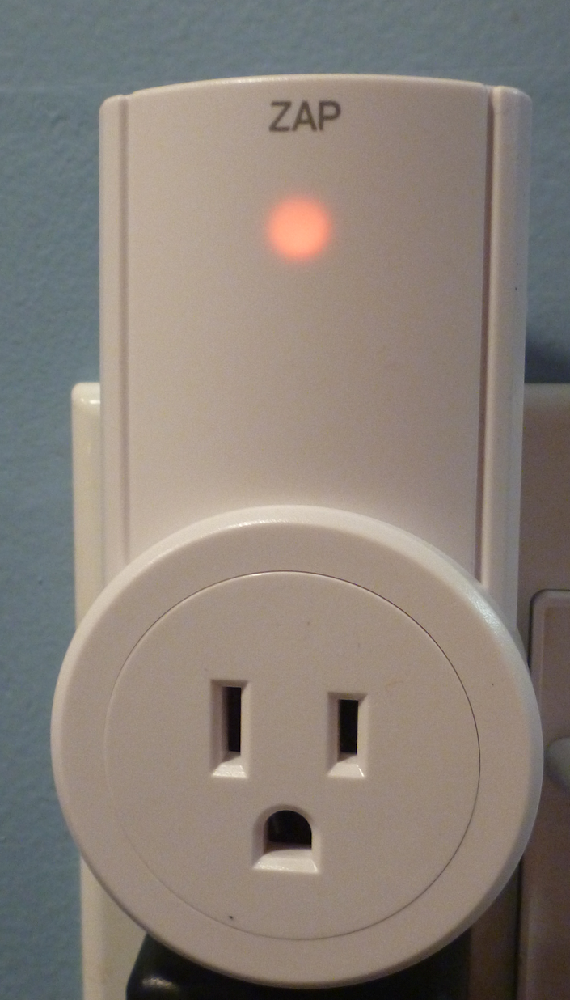
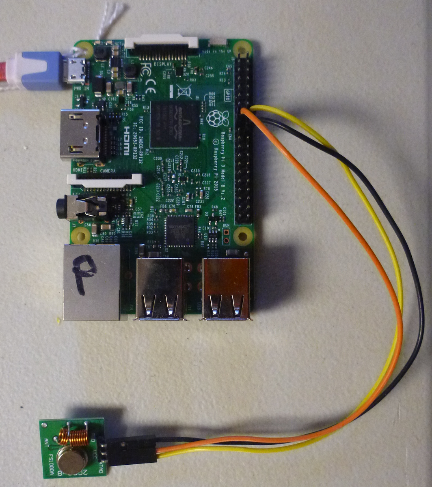

#Etekcity Sensor Controller

This software, when used with a
[433 MHz transmitter](https://www.amazon.com/gp/product/B017AYH5G0),
allows a Raspberry Pi to wirelessly control the
[Etekcity Outlet Switch](https://www.amazon.com/gp/product/B00DQELHBS/) 
devices.

In addition to the transmitter and device one also requires some 
[jumper wires](https://www.amazon.com/gp/product/B01LZF1ZSZ/)
to connect the parts.

The Outlet switches are identified by two numbers.  First is a device
address which ranges from 0 to 255.  All outlet switches in a single 
package have the same address.

While the devices in a package share an address, each has a unique unit 
number which can 1 through 5.  With these two numbers software can use the
transmitter to send patterns to the outlet switches on and off.

This arrangement allows a Raspberry Pi to control powered devices without
direct connections to hazardous voltages.

Once the parts are availble one should be able to install and configure
the software to control the outlets under an hour.  The steps include:

* Install the software in the Raspberry Pi
* Configure the software 
* Plug in the outlet switches and make sure they work with the provided control.
* Attach the transmitter to the Raspberry Pi.
* Determine the address for the outlet switches.
* Start a simple web server which allows control via browser or REST
* Enjoy!

###Install the software in the Raspberry Pi (5 minutes)

The software and scripts assume the software is installed in `/opt`, a
standard directory for "optional" software.  To install the software use

`sudo /usr/bin/bash -c 'cd /opt ; git clone https://github.com/pgcrumley/Controllers.git ' `

This will place a copy of the software in `/opt` and leave behind
information that makes it easy to retrieve updates later if needed.

Next `cd /opt/Controllers/Etekcity/` and make sure there are
a number of python and other scripts present.

###Configure the software (15 minutes -- longer if system is not up-to-date)

Install python3 and the RPi.GPIO library using a command of:

`sudo apt-get install python3 TBD`

Make sure `python3` works and RPi.GPIO is installed by typing:

    python3
    import RPi.GPIO
    exit()

Your console should look like this:

    $ python3
    Python 3.6.1 (default, Mar 24 2017, 12:50:34)
    [GCC 5.4.0] on cygwin
    Type "help", "copyright", "credits" or "license" for more information.
    >>> import RPi.GPIO
    >>> exit()
    
    $

The version numbers may vary but there should not be any messages after the
`import RPi.GPIO` line.    

###Plug in the outlet switches and make sure they work with the provided control. (5 minutes)

Unpack the outlet switches and install the battery in the included remote.
Plug one or more of the outlet switches in to a wall outlet and make sure 
the devices switch on and off when you use the remote control.  You can

When the outlet switch is "on" a red light will illuminate as shown below:

When the outlet switch is "off" the red light is also off as shown below:

It would be a good idea to plug a lamp or other electric device in to the 
outlet switches to verify they operate correctly before proceeding.

When you are sure the outlets all work correctly it is time to let the 
Raspberry Pi control them.

Leave the outlet switches plugged in to a receptical so you are ready to
determine the address and test them after the transmitter is attached to
the Raspberry Pi.

###Attach the transmitter to the Raspberry Pi. (10 minutes)

Three wires connect the transmitter to the Raspberry Pi.  The wires are

Function | Color in picture | Raspberry Pi Pin Number | Pin Name
---- | ---- | -----
3.3 volt power | Orange | 17 | GPIO 24
Ground | Black | 20 | GND
Signal | Yellow | 18 | 3.3V PWR

Power down your Rapsberry Pi before making the connections with the GUI or 
a command such as `sudo shutdown now`

Connect the transmitter to the Raspbery Pi as shown:

You can choose different colors for the wires.

Note that the pins on the connector start with 1 in the upper left position 
and pin 2 is in the upper right location.  The pins in the next row down are
3 and 4, then 5 and 6. This continues with the bottom left pin of 39 and the 
bottom right pin of 40.  Older boards only have only 28 pins.

An image of the pins with pin numbers and names is available
[here](https://github.com/DotNetToscana/IoTHelpers/wiki/Raspberry-Pi-2-and-3-Pinout).

Please note that many of the pins have names such as "GPIO 12" or "GPIO 17".
The number in the GPIO name tells how the pins are used by the hardware.
Here we are using the pin numbers (not names) and the names simply refer to
the pins' location on the board, not what they do.  

For this project we connect the `DATA` pin on the transmitter (yes, the 
word `DATA` is written backwards on the transmitter board) to 
pin number 18.  Pin 18 has a name of `GPIO 24`.  

Check the connections twice to be sure before proceeding.

###Determine the address for the outlet switches. (10 minutes)

Once the transmitter is connected power up your Raspberry Pi.  Login and 
return to `/opt` with `cd /opt`

Make sure the transmistter works by running the command:

`sudo ./

###Start a simple web server which allows control via browser or REST (5 minutes)

###Enjoy! 

